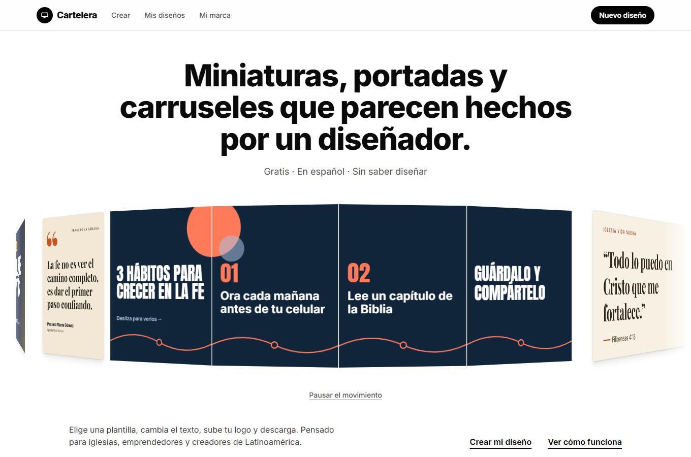
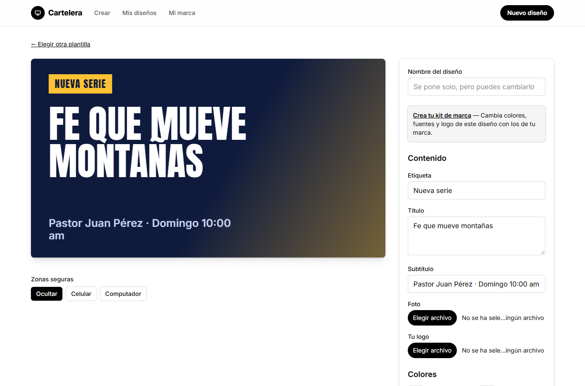
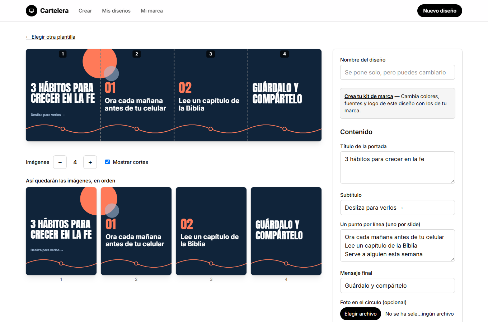

# Cartelera

Generador de **miniaturas de YouTube, posts de Instagram y carruseles panorámicos** con plantillas profesionales, pensado para iglesias, emprendedores y creadores pequeños de Latinoamérica que no saben diseñar. Todo en español, gratis y funciona en el navegador, sin servidor propio.

> Proyecto de portafolio. Estado: MVP funcional. Un GIF de demostración está pendiente.



| Editor | Carrusel panorámico |
|---|---|
|  |  |

Las capturas se regeneran con `node scripts/screenshots.mjs` (con la app corriendo).

## Qué hace

1. Eliges qué crear: miniatura de YouTube (1280×720), post de Instagram (1080×1350) o **carrusel panorámico** de Instagram (de 2 a 10 imágenes de 1080×1350 que se ven como una sola pieza al deslizar).
2. Eliges una plantilla (5 en el MVP) y cambias textos, fotos, logo, colores y fuentes. La vista previa es en vivo.
3. Descargas PNG o JPG. El carrusel baja en un **ZIP con imágenes numeradas** (`01.png`, `02.png`…), en el orden para subirlas.

Lo que lo diferencia de un editor de lienzo libre:

- **Carrusel panorámico**: un solo lienzo continuo que se corta solo, con elementos que cruzan los cortes.
- **Zonas seguras visibles**: muestra qué se tapa o recorta (duración del video en YouTube, cuadrícula del perfil en Instagram).
- **Plantillas como código**: componentes React con un esquema de campos; el formulario se genera solo y el texto se ajusta solo.
- **Kit de marca**: logo, colores y fuentes guardados una vez y aplicados a cualquier plantilla con un clic.
- **Se usa sin cuenta** (todo queda en el dispositivo). Con cuenta, los diseños y la marca se sincronizan en la nube y se pueden compartir por enlace.

## Stack

React 19 · TypeScript · Vite · Tailwind CSS 4 · Zustand · React Router · IndexedDB (`idb`) · `modern-screenshot` (exportación) · `fflate` (ZIP) · Supabase (auth, Postgres, Storage) · Vitest · Playwright + axe-core · pnpm workspaces.

## Arquitectura

```
cartelera/
  apps/web/              App (Vite + React): editor, galería, cuenta, marca, landing
    src/features/
      editor/            Vista previa, panel de campos, zonas seguras, carrusel, autoguardado
      export/            PNG/JPG, cortes del carrusel, ZIP
      storage/           Repositorios locales (IndexedDB) y manejo de imágenes
      cloud/             Repositorios Supabase, motor de sincronización, compartir
      auth/  account/  brand/  gallery/  share/
  packages/core/         Tipos, formatos y zonas seguras (datos), cortes, autofit, contraste, migraciones
  packages/templates/    Plantillas: manifiesto (datos) + componente React
  supabase/              Migraciones SQL con RLS y script de verificación de políticas
  e2e/                   Pruebas de extremo a extremo (Chromium/Edge, WebKit, Firefox)
```

Decisiones principales:

- **Render con React DOM + captura**, no Canvas 2D ni Remotion. Las plantillas son componentes React normales y la vista previa es idéntica a lo exportado. Remotion se reserva para la fase de video (su render clásico necesita servidor).
- **Modelo de plantilla**: `TemplateDef` = manifiesto con datos puros (`id`, formatos, `fields`, valores por defecto, paleta, fuentes) + `Component`. El editor genera el formulario del esquema de campos.
- **Persistencia detrás de interfaces** (`DesignRepo`, `AssetRepo`, `BrandRepo`): hay una implementación en IndexedDB y otra en Supabase. Cambiar de backend no toca la interfaz.
- **Documento versionado** (`Design.v`) con función de migración que nunca lanza: lo corrupto o de una versión futura se ignora en vez de romper la app.

Flujo de exportación:

```
Design ─► monta la plantilla fuera de pantalla a tamaño real ─► espera fuentes e imágenes
       ─► captura a Blob (PNG/JPG)
Carrusel: por cada imagen i, ventana de 1080×1350 con el panorama desplazado -i·1080
       ─► N Blobs ─► ZIP (01.png … 0N.png)
```

## Retos técnicos

**Exportar sin servidor con la misma fidelidad que la vista previa.** La vista previa se escala con CSS, pero lo exportado debe ser a tamaño real. Se monta la plantilla en un contenedor fuera de pantalla sin escalar, se espera a `document.fonts.ready` y a que las imágenes decodifiquen, y recién entonces se captura. Aprendizaje: la espera no puede depender de `requestAnimationFrame`, que no se dispara en pestañas ocultas: si la persona cambia de pestaña mientras se genera el ZIP, la exportación se colgaba. Se cambió por un temporizador.

**Carrusel sin costuras y sin lienzos gigantes.** En vez de dibujar un canvas de 10 800 px y recortarlo (que revienta el límite de píxeles de iOS), cada imagen es una ventana de 1080×1350 sobre el mismo panorama desplazado en múltiplos exactos del ancho. Una prueba automática descomprime el ZIP y compara píxeles: en cada corte, la diferencia entre la última columna de una imagen y la primera de la siguiente es del mismo orden que la de dos columnas vecinas dentro de una misma imagen.

**Galería 3D arrastrable en la portada.** Las tarjetas giran sobre un cilindro con `perspective` y `rotateY(θ) translateZ(R)`; la posición de cada una sale de una función pura (`layoutCylinder`) que reparte tarjetas de distinto ancho sobre el arco. El arrastre usa Pointer Events con inercia y escribe directo en el DOM, sin re-renderizar por cuadro; si nadie la toca, se mueve sola de lado a lado y suaviza el arranque, el frenado y la inversión en los extremos. Como todo movimiento automático (WCAG 2.2.2), se detiene al pasar el cursor, al enfocarla, al arrastrar y cuando la pestaña o la galería no están a la vista; hay un botón de pausa, las flechas del teclado la controlan, `prefers-reduced-motion` la desactiva y `touch-action: pan-y` deja el scroll vertical libre en celular. Las 4 imágenes del carrusel panorámico van pegadas en la galería para que se vea que forman una sola pieza.

**Texto que siempre cabe.** `AutoFitText` busca por bisección el mayor tamaño de fuente que cabe en su caja (algoritmo puro y probado, con el medidor inyectado). Se recalcula al cargar las fuentes. Detalle aprendido: en mayúsculas con `line-height` bajo, las tildes (Á, Ñ) se cortaban por arriba; se resolvió con un pequeño margen superior.

**Zonas seguras como datos, no como código.** Cada formato declara rectángulos en fracciones y las vistas donde aplican (`mobile`, `desktop`, `profile-grid`). Agregar una portada de YouTube o una historia es añadir datos. El overlay es una capa aparte de la vista previa y nunca entra en la imagen exportada (se verificó leyendo píxeles).

**Local primero, nube después.** Cada persona tiene su propia base IndexedDB (`guest` o su id de usuario). Al iniciar sesión, lo hecho como invitado se mueve a la cuenta sin pisar lo más reciente. La sincronización es "gana el último cambio" por `updatedAt`, con lápidas para propagar borrados sin resucitarlos, errores aislados por diseño, y es idempotente (probado: una segunda sincronización no hace nada). Límite conocido: no hay fusión campo a campo; si el mismo diseño se edita en dos dispositivos sin conexión, gana el más reciente.

**Seguridad en la base de datos.** Las tablas tienen RLS: cada usuario solo lee y escribe lo suyo, y sin sesión solo se leen los diseños marcados como públicos. Un upsert con el id de un diseño ajeno falla. `supabase/tests/rls_check.sql` verifica estos casos. Las imágenes viven en un bucket público con rutas `<usuario>/<uuid>` (no adivinables) para poder mostrar diseños compartidos; es una decisión consciente.

**Imágenes en móviles.** Al subir, las imágenes se reducen a 2560 px por el lado mayor y se guardan como WebP (conserva transparencia para logos). Se guardan como `Blob` en IndexedDB y se muestran con `objectURL`.

**Formulario generado desde el esquema.** `fields` describe cada campo (`text`, `textarea`, `image`, `select`, `toggle`) y hay tests que garantizan que toda plantilla tiene un valor por defecto por campo y viceversa.

**Accesibilidad verificada, no supuesta.** axe-core corre en las pruebas de extremo a extremo sobre 10 pantallas con las reglas WCAG 2.1 A y AA. Además: enlace para saltar al contenido, foco al contenido al navegar, títulos por página, anuncios con `aria-live` y validación de contraste de la paleta de la persona.

## Cómo correrlo

Requisitos: Node 22+ y pnpm 10.

```bash
pnpm install
pnpm dev            # http://localhost:5173
```

Sin configurar nada, la app funciona completa en modo local (sin cuentas ni nube).

### Cuentas y nube (opcional)

1. Crea un proyecto en [supabase.com](https://supabase.com).
2. Ejecuta `supabase/migrations/0001_init.sql` en el editor SQL.
3. (Opcional) Activa el proveedor Google en Authentication → Providers y añade `http://localhost:5173/cuenta` a las URL de redirección.
4. Copia `apps/web/.env.example` a `apps/web/.env.local` y completa `VITE_SUPABASE_URL` y `VITE_SUPABASE_ANON_KEY`.
5. Ejecuta `supabase/tests/rls_check.sql` en el editor SQL para comprobar las políticas.

## Pruebas

```bash
pnpm typecheck
pnpm test           # Vitest: 102 pruebas (core, plantillas, app)
pnpm test:e2e       # Playwright en Chromium/Edge
pnpm test:e2e:all   # además WebKit (Safari) y Firefox
```

Los tests de extremo a extremo (33 por navegador) cubren: exportación PNG/JPG a tamaño real, ZIP del carrusel con comprobación de píxeles en los cortes, foto subida visible en lo exportado, guardado y recuperación tras recargar, duplicar y eliminar, aplicar la marca, la galería 3D y accesibilidad con axe. `e2e/qa-regresiones.spec.ts` reúne los errores encontrados en la revisión de calidad para que no vuelvan.

## Despliegue

Pensado para Vercel o Netlify (sitio estático). `vercel.json` ya define el comando de build, el directorio de salida, la reescritura para rutas de la SPA y cabeceras de seguridad. Variables de entorno: las dos de Supabase.

## Qué falta

- Plantillas y formatos adicionales (portada de YouTube, portada de Facebook, historias y reels). Añadirlos es agregar datos y una plantilla.
- Exportación a video (MP4) con fondos animados WebGL.
- Quitar el fondo de fotos, fuentes subidas por la persona, plantillas por categoría, equipos.
- Compartir directo a la galería del celular con la Web Share API.
- Fusión de cambios por campo en la sincronización.

## Licencia

MIT. Las fuentes (Anton, Bebas Neue, Playfair Display, Inter, Montserrat) se distribuyen con licencia OFL vía `@fontsource`.
